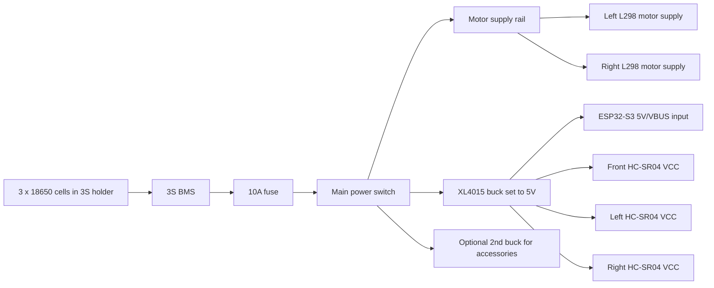

# Wiring And Power Reference

This file is the project reference wiring map that matches the current rover firmware in [src/main.cpp](../src/main.cpp). It is the text version of the updated PDF manual pages.

## Visual Diagrams

- Wiring diagram image: [esp32-rover-wiring-diagram.png](./esp32-rover-wiring-diagram.png)
- Power flow image: [esp32-rover-power-flow-diagram.png](./esp32-rover-power-flow-diagram.png)
- Sensor placement image: [esp32-rover-sensor-placement.png](./esp32-rover-sensor-placement.png)
- Step-by-step connection guide: [parts-connection-guide.md](./parts-connection-guide.md)
- Assembly order checklist: [assembly-order-checklist.md](./assembly-order-checklist.md)

## Current Firmware Pin Map

| Function | Signal | ESP32-S3 GPIO | Notes |
|---|---|---:|---|
| Onboard RGB LED | WS2812 data | 48 | Already on the board |
| Front ultrasonic | TRIG | 4 | HC-SR04 front sensor |
| Front ultrasonic | ECHO | 5 | Use a 5V-to-3.3V divider |
| Left ultrasonic | TRIG | 6 | HC-SR04 left sensor |
| Left ultrasonic | ECHO | 7 | Use a 5V-to-3.3V divider |
| Right ultrasonic | TRIG | 8 | HC-SR04 right sensor |
| Right ultrasonic | ECHO | 9 | Use a 5V-to-3.3V divider |
| Left L298 module | ENA | 10 | Front-left motor PWM |
| Left L298 module | IN1 | 11 | Front-left direction |
| Left L298 module | IN2 | 12 | Front-left direction |
| Left L298 module | ENB | 13 | Rear-left motor PWM |
| Left L298 module | IN3 | 14 | Rear-left direction |
| Left L298 module | IN4 | 15 | Rear-left direction |
| Right L298 module | ENA | 16 | Front-right motor PWM |
| Right L298 module | IN1 | 17 | Front-right direction |
| Right L298 module | IN2 | 18 | Front-right direction |
| Right L298 module | ENB | 21 | Rear-right motor PWM |
| Right L298 module | IN3 | 38 | Rear-right direction |
| Right L298 module | IN4 | 39 | Rear-right direction |

## Reserved Pins

- Do not use `GPIO35`, `GPIO36`, or `GPIO37` on this `ESP32-S3-N16R8` board.
- Those pins are reserved by the module memory layout and caused instability earlier in this project.

## Motor Driver Wiring

### Left L298 Module

- Output channel A -> front-left motor
- Output channel B -> rear-left motor
- `ENA -> GPIO10`
- `IN1 -> GPIO11`
- `IN2 -> GPIO12`
- `ENB -> GPIO13`
- `IN3 -> GPIO14`
- `IN4 -> GPIO15`

### Right L298 Module

- Output channel A -> front-right motor
- Output channel B -> rear-right motor
- `ENA -> GPIO16`
- `IN1 -> GPIO17`
- `IN2 -> GPIO18`
- `ENB -> GPIO21`
- `IN3 -> GPIO38`
- `IN4 -> GPIO39`

## Ultrasonic Sensor Wiring

All three `HC-SR04` sensors follow the same power pattern:

- `VCC -> 5V logic rail`
- `GND -> common ground`
- `TRIG -> ESP32 GPIO`
- `ECHO -> ESP32 GPIO through a voltage divider`

### Sensor GPIO Map

- Front sensor: `TRIG GPIO4`, `ECHO GPIO5`
- Left sensor: `TRIG GPIO6`, `ECHO GPIO7`
- Right sensor: `TRIG GPIO8`, `ECHO GPIO9`

### ECHO Divider

The `HC-SR04` ECHO output can be `5V`, while the ESP32-S3 GPIO is `3.3V` logic.

Use a resistor divider on each ECHO line. Example:

- `10k` from `HC-SR04 ECHO` to the ESP32 input pin
- `20k` from the ESP32 input pin to `GND`
- You can make `20k` using two `10k` resistors in series

## Recommended Power Flow

This is the reference architecture for the parts you already bought.

## Power Notes

- All grounds must be common:
  - battery/BMS output ground
  - ESP32 ground
  - both L298 grounds
  - all HC-SR04 grounds
  - buck converter grounds
- Use one `XL4015` as the main `5V` logic rail.
- The second `XL4015` can be reserved for future accessories or a separate clean rail.
- Do not use the `AMS1117` as the main drop from the full `3S` battery voltage to the ESP32 supply.
- Put a `1000uF` capacitor near the motor driver supply rail.
- Put `100nF` decoupling close to logic rails where practical.

## ESP32 Power Input

Use one of these:

- the board's `5V` / `VBUS` input pin, if exposed and clearly labeled
- or a short USB power lead from the `5V` buck output to the ESP32 board

Do not feed raw `3S` battery voltage directly into the ESP32 logic supply.

## Current Project Scope

This reference matches the firmware and documentation as they stand now:

- local ESP hotspot control
- same-router control
- GitHub Pages remote control through MQTT cloud
- three ultrasonic sensors
- two L298 modules
- four DC motors
- onboard RGB LED

Before final assembly, verify every physical wire against the current [src/main.cpp](../src/main.cpp) pin constants.
